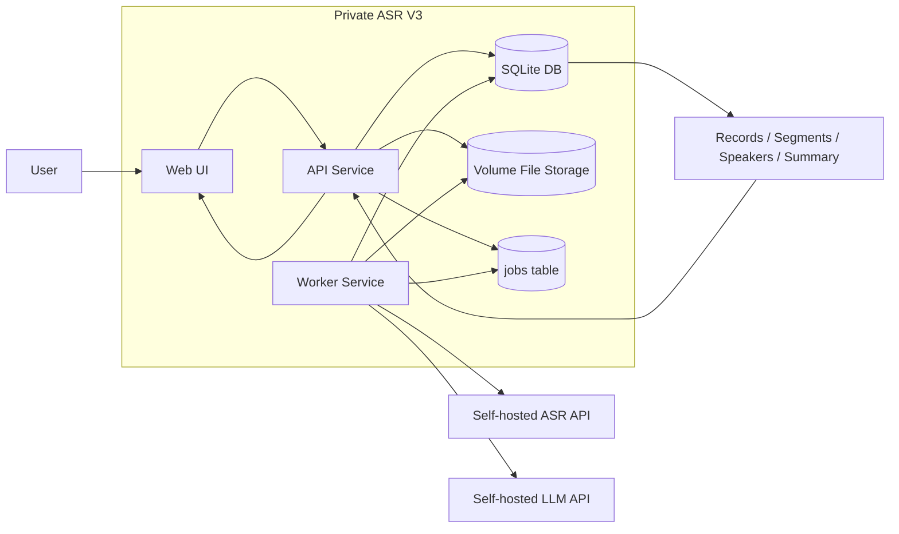
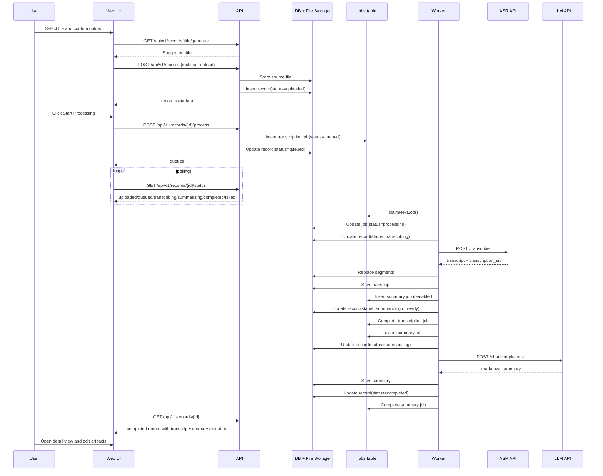
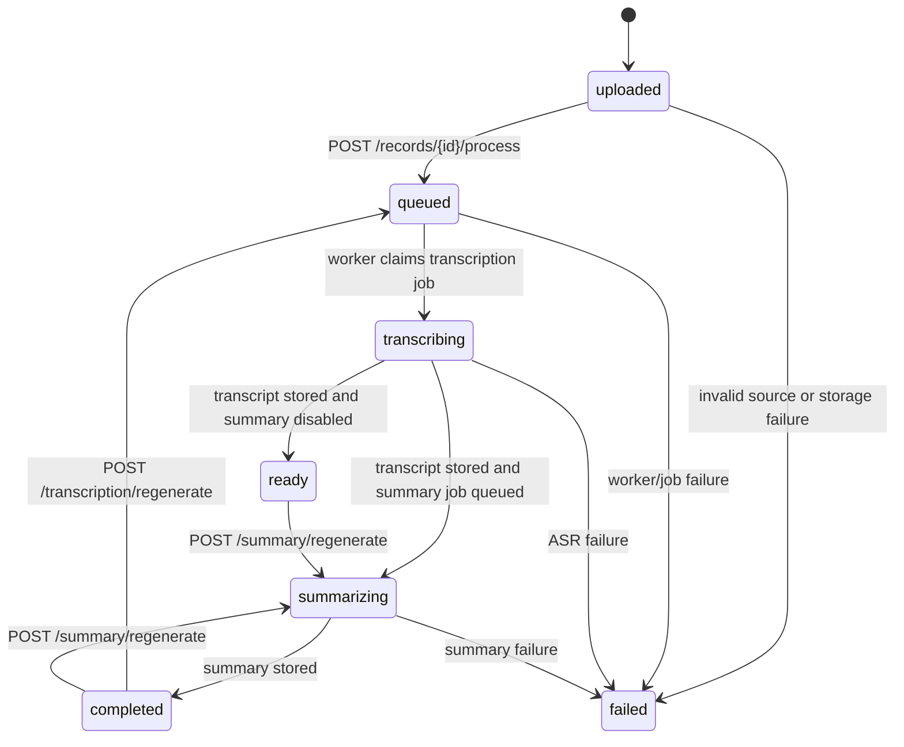
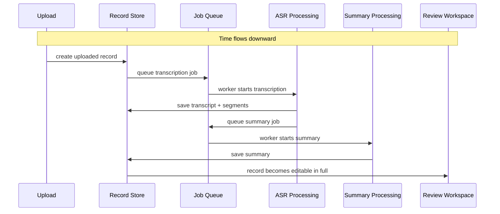

# Workflow Analysis

## 1. Purpose

This document explains how the current Private ASR V3 workflow operates after the architectural reset from the archived realtime repo.

Focus:

- how a new record is created
- which component owns each step
- where persistence happens
- why the workflow is more reliable than the previous realtime chain

## 2. Workflow Thesis

The current system treats "add a record" as an asynchronous workspace flow, not as a browser recording session.

That means:

1. a file becomes a durable `record` first
2. processing becomes a durable `job` second
3. expensive ASR and summary work runs in `worker`, not in the request path
4. the web UI polls status instead of holding a live streaming session open

This is the central design change from the old repo.

## 3. High-Level Architecture Diagram

## 4. Sequence Diagram: Add One Record

The current frontend intentionally keeps the old two-step interaction:

1. upload file
2. click `Start Processing`

This preserves the previous UX while using the new backend model.

## 5. Record State Timeline

## 6. Functional Swimlane View

This is the "functions on the horizontal axis, time on the vertical axis" view.

## 7. Detailed Step-by-Step Explanation

### Step 1: Upload persists a record before any ASR work

Current frontend path:

- `GET /api/v1/records/title/generate`
- `POST /api/v1/records`

Backend effect:

- source file is written to volume storage
- a `records` row is created with `status=uploaded`

Why this matters:

- the system has a durable object immediately
- if ASR is down, the upload is still not lost
- users can still see that the file exists in the workspace

### Step 2: Processing is explicit

Frontend then calls:

- `POST /api/v1/records/{id}/process`

Backend effect:

- a `jobs` row is inserted
- the record moves to `queued`

Why this matters:

- processing is no longer hidden inside the upload request
- the UI can preserve the old "Upload Complete -> Start Processing" workflow
- agents can choose between upload-only and upload-and-process behavior

### Step 3: Worker owns the long-running path

The `worker` polls queued jobs and claims one job at a time.

Worker effect:

- mark job as `processing`
- mark record as `transcribing`
- call external ASR
- parse transcript / SRT into canonical `segments`
- save transcript and speaker labels

Why this matters:

- long-running I/O is no longer coupled to an HTTP timeout window
- if the worker crashes, jobs remain durable
- the API service stays responsive during processing

### Step 4: Summary is its own phase

If summary is enabled:

- transcription phase queues a summary job
- summary phase calls the LLM provider
- record becomes `completed` after summary is stored

Why this matters:

- transcript storage does not depend on summary success
- summary can be rerun independently later
- ASR and LLM failures are separated

### Step 5: UI consumes status, it does not maintain the pipeline

The web UI now:

- polls `/records/{id}/status`
- refreshes the record view
- edits transcript, segments, and speaker names after persistence exists

The UI no longer:

- streams audio live
- tracks chunk numbers
- retries missing chunks
- performs auto-finalize and recording recovery

Why this matters:

- fewer browser-only edge cases
- fewer state races
- simpler debugging

## 8. Why This Workflow Is More Mature Than the Old One

### A. Persistence happens earlier

Old model:

- audio session and chunk graph had to stay healthy long enough to be finalized correctly

New model:

- record exists first
- processing exists second

This is a much safer ordering.

### B. Transport and business logic are no longer mixed

Old model tightly coupled:

- browser audio capture
- chunk transport
- backend merge logic
- recovery logic
- ASR processing

New model separates:

- upload transport
- record persistence
- job orchestration
- ASR execution
- summary execution

### C. Failure modes are simpler

Old failure examples:

- browser backgrounding
- chunk mismatch
- finalize timeout
- abandoned recording cleanup
- websocket disconnect while recording

New failure examples:

- upload failed
- transcription job failed
- summary job failed

This is a smaller and more intelligible state space.

### D. It is more agent-friendly

An AI agent can now operate on:

- `record`
- `segment`
- `speaker`
- `job`

It no longer has to simulate a recording session or reason about chunk lifecycles.

## 9. Current Reliability Boundaries

The new workflow is more reliable, but still intentionally bootstrap-level in some areas:

- queue is implemented with DB polling, not a dedicated queue system
- storage is `SQLite + local volume`, not distributed storage
- web still polls for status rather than subscribing to server push

Even so, the architecture is already more robust than the old repo because the fundamental boundaries are cleaner.

## 10. Practical Design Decision: Why Keep Upload and Process as Two Steps

The new backend supports both:

- `POST /api/v1/records`
- `POST /api/v1/records/import`

Reason:

- the web UI keeps the old user rhythm: upload first, then process
- API clients and future agents can use the one-step import path if they want

This is a useful compromise:

- UX continuity for humans
- atomic endpoints for tools
- clean async orchestration in the backend

## 11. Files That Implement This Workflow

- API bootstrap: `apps/api/src/server.js`
- Record APIs: `apps/api/src/routes/records.js`
- DB schema: `apps/api/src/lib/database.js`
- Worker orchestration: `apps/worker/src/index.js`
- Web workflow shell: `apps/web/index.html`
- Web behavior: `apps/web/app.js`
